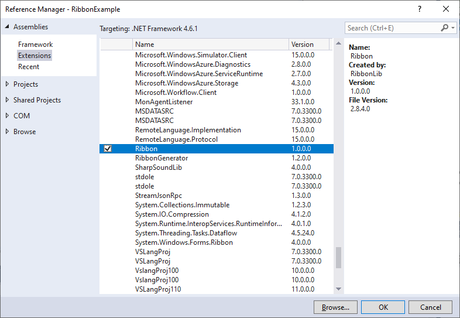
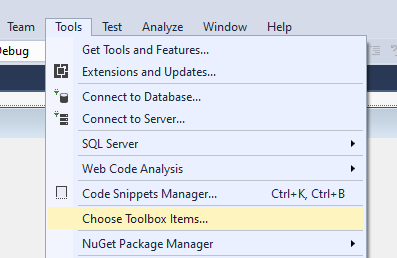
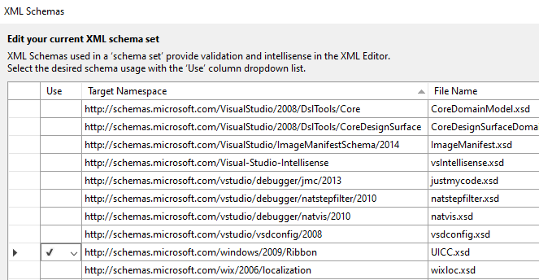
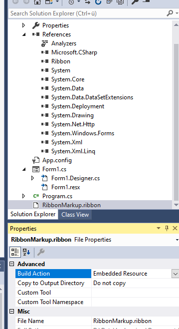

# How to use .NET Windows Ribbon

## [Limitation]
- You can use WindowsRibbon with Windows 7 or later Windows versions (Windows 8, Windows 10)

## [Workflow]
1. See Installation.

2. For building an application with Ribbon one have to create a Windows Forms App.

3. In Solution Explorer References: choose -> Add Reference -> Assemblies -> Extensions -> Ribbon.dll 
  In newer versions the name of the Ribbon is: ***Windows Ribbon for .NET*** 

3. 

4. Visual Studio  Menu: Tool -> Choose Toolbox Items: Select Ribbon with Namespace RibbonLib
    
    

5. Place a Ribbon to the Form with name ribbon1 (you can choose any other name).

6. Now create a RibbonMarkup.xml  (you can choose any other name) file in your Visual Studio project with "Properties -> Build Action" = Content. 
    Visual Studio Menu: XML -> Schemas...: Select http://schemas.microsoft.com/windows/2009/Ribbon with Filename UICC.xsd (UICC.xsd is in the Windows SDK bin folder). Maybe you have to add this schema first in the dialog "XML Schemas".
    

    Insert Application Commands and Application Views as you can see in the samples and the documentation in the wiki.
    **Hint**: If you have more than one Ribbon Control for different Forms in the project, then you should name the RibbonMarkup.xml to RibbonMarkup1.xml, RibbonMarkup2.xml, ... ,RibbonMarkup9.xml 

7. Because CustomTools, like Bernhard Elbl said, do not work this way in newer Visual Studio versions like VS 2017 you have to
    open a Console Window in the folder of RibbonMarkup.xml (maybe we have a solution for a CustomTool later on). Or you can use the RibbonTools.exe to design, build and preview the markup file.

8. Have a call from the Console Window in the path of RibbonMarkup.xml: RibbonTools RibbonMarkup.xml --build

9. If the build fails with a "No Tools" error, then check the installation of the Windows SDK and the C++ Tools in Visual Studio. If the installations are OK, start the RibbonTools from Windows Startmenu, go to Settings and search for the tools uicc.exe, rc.exe and link.exe and build again.

12. Now you get some generated files, eg. RibbonMarkup.ribbon and RibbonItems.Designer.cs. Add these files to your project.

13. Set the Property Build Action of RibbonMarkup.ribbon to Embedded Resource.


14. In Windows Form Designer select the Ribbon and set the Property ResourceName of the Ribbon Control to [Default namespace of your application assembly].RibbonMarkup.ribbon

15. Add
```
        using RibbonLib;
        using RibbonLib.Controls;
        using RibbonLib.Interop;
        using RibbonLib.Controls.Events;
```

to the Form1.cs. In the Constructor (Ctor) of the Forms1 after InitializeComponents() you have to call   RibbonItems ribbonItems = new RibbonItems(ribbon1);
This is a wrapper class for all defined Ribbon Items. You can extend this class because it is a partial class.

16. Define the code behind for the Ribbon items in C# or VB language.

17. Now compile your application and run

## [Extensions in newer versions]
Version 2.8 of Ribbon.dll: The Ribbon property "ResourceName" can also be a file based resource file. In case of a file based resource file the name must start with file:// like an Uri path. If the RibbonMarkup.ribbon is located in the same path as the application.exe, then you can define 
```
ResourceName = file://RibbonMarkup.ribbon
```
If you have a special directory for the path you can also write 
```
file://{LocalApplicationData}/your_path/RibbonMarkup.ribbon
```
Localization is also supported with the file based resource file.

Names of special directories you can find in [Environment.SpecialFolder](https://docs.microsoft.com/en-Us/dotnet/api/system.environment.specialfolder?view=netframework-3.5) 

In the latest release we got the RibbonTools to design, build and preview the Ribbon.

## [Installation]
Installation of Visual Studio (any version since Visual Studio 2010 up to later ones) is required.
Minimum installation components in Visual Studio are .NET Desktop Development and C++ Desktop Development.

Installation of the Windows SDK which is suitable for your Windows version
eg. If you have Windows 7 as Operating System (OS), than you have to install Windows 7 SDK
If you have Windows 10 as OS, than you have to install Windows 10 SDK.

Download "msi.zip" from the releases page of this GitHub repository. Unzip "msi.zip" and install "Ribbon.msi" and "RibbonTools.msi".
RibbonTools.exe will build a .ribbon file.

Ribbon.msi installs Ribbon.dll to the Global Assembly Cache (GAC). The Ribbon.dll contains a Ribbon Control and mainly the Wrapper Classes for the Ribbon Elements
RibbonTools.msi installs the components to the 32 Bit ProgramFiles folder RibbonLib and adds the Environment Path to this folder.
You can start the app from Windows Startmenu or from Commandline.

## Useful Links
[Microsoft Windows Ribbon Framework](https://docs.microsoft.com/en-us/windows/win32/windowsribbon/-uiplat-windowsribbon-entry)

[Codeplex archive](https://archive.codeplex.com/?p=windowsribbon)

[Table of Content for Documentation](https://www.codeproject.com/Articles/55599/Windows-Ribbon-for-WinForms-Part-Table-of-Conten)

[Windows Ribbon Framework for Delphi](https://bilsen.com/windowsribbon/index.shtml)
From this page you can get a very good tutorial for the Ribbon.

## Hints
When using ApplicationModes to a Tab or Group then you should define ApplicationMode to all Tabs and Groups in the RibbonMarkup.xml. If you don't do this you can get a Application shutdown when switching the ApplicationMode.